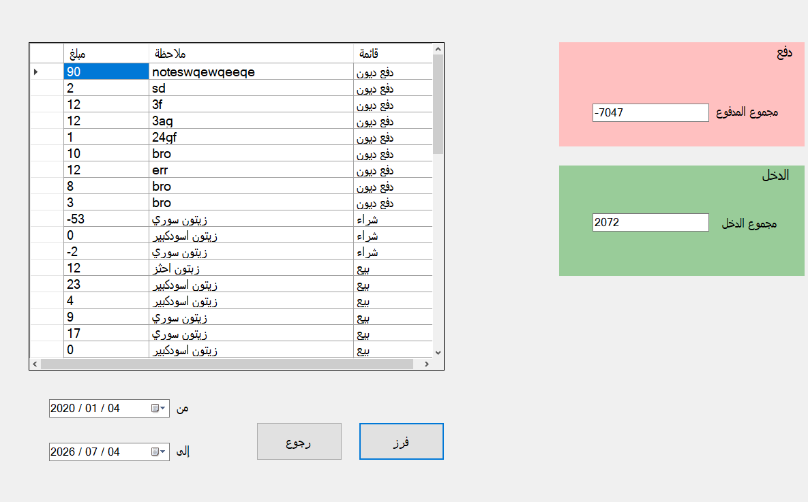

# Marwan Muhammed

### Electrical Engineer | Software Developer 

## 👨‍💻 About Me

- Currently working on **BazarO, an ecommerce application **
-  Learning **react native**
- main email :  **marwan50craft@gmail.com**

---

## 🛠️ Tech Stack

### Languages
- JavaScript
- C++
- TypeScript

### framework
- .net framework
- React native
- unity c#
- Embedded C

### Database
- Microsoft SQL
- appwrite

### Tools
- git/github
- chatgpt :]

---

## Projects summary

| Project | Description | Tech |
|---------|-------------|------|
| smart electricity monitoring system| harware and software for the system responsible of monitoring the electricity consumption in a house and sending it to your phone | Embedded C, Java android studio, Sockets|
| smart irrigation system | a schedual based and remote controled irrigation system with hardware and software | Embedded C, Java android Studio, GSM |
| general poprpos expense tracker (XGMK) | custom built a expense tracker for a local company, with inventory management and expense analysing| C++ CLR .netframework, micorosft SQL |

---
## More about my Projects

### 1 - XGMK

A general-purpose expense tracking app I built using **C++**, **.NET Framework 4.8**, and **Microsoft SQL Server**. It consists of multiple windows for sales, expenses, salaries, and more.

The app was my first project, so the codebase was fairly unstructured. I didn't plan the architecture beforehand, and it contains limited object-oriented design and software engineering practices.

*Figure 1: XGMK showing dummy data.*
---

## Contact me
primary Email : marwawn50craft@gmail.com

---
