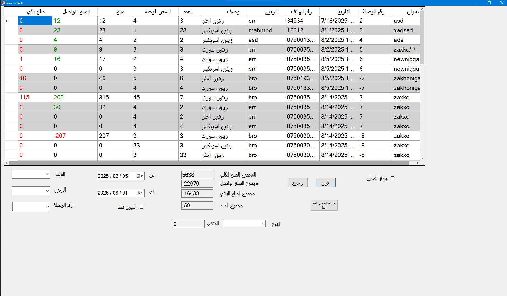
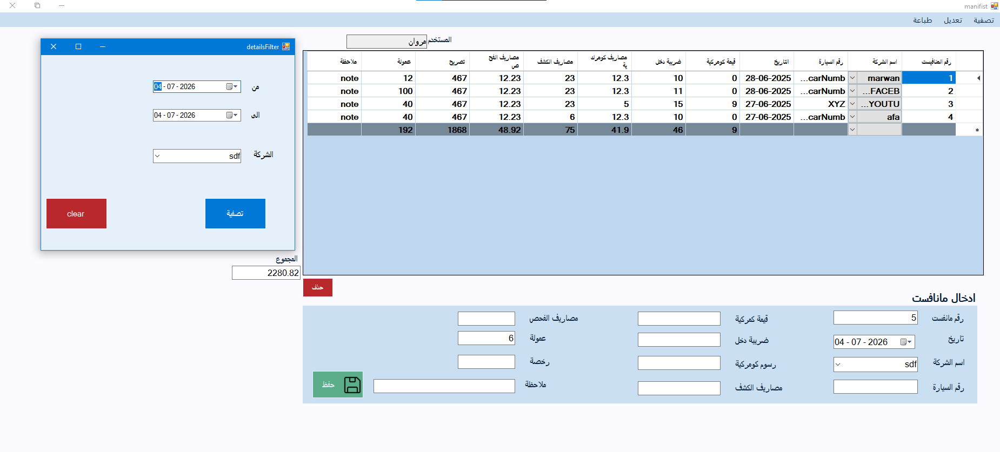

# Marwan Muhammed

### Electrical Engineer | Software Developer 

## 👨‍💻 About Me

- Currently working on **BazarO, an ecommerce application **
-  Learning **react native**
- main email :  **marwan50craft@gmail.com**

---

## 🛠️ Tech Stack

### Languages
- JavaScript
- C++
- TypeScript

### framework
- .net framework
- React native
- unity c#
- Embedded C

### Database
- Microsoft SQL
- appwrite

### Tools
- git/github
- chatgpt :]

---

## Projects summary

| Project | Description | Tech |
|---------|-------------|------|
| smart electricity monitoring system| harware and software for the system responsible of monitoring the electricity consumption in a house and sending it to your phone | Embedded C, Java android studio, Sockets|
| smart irrigation system | a schedual based and remote controled irrigation system with hardware and software | Embedded C, Java android Studio, GSM |
| general poprpos expense tracker (XGMK) | custom built a expense tracker for a local company, with inventory management and expense analysing| C++ CLR .netframework, micorosft SQL |

---
## More about my Projects

### 1- XGMK
a genral porpus expense tracking app I custom built using c++ .netframework 4.8 and microsoft SQL server, it consist of many windows showing sales, expenses, salaries and more.

the app was my first project and it was done during collage, so it was a bit of a mess interms of code, I didn't plan for anything i just wrote code, it didn't contain much oop or software engineering concept

-this image showes the sales tracking windows in the application, with dummy data

### 2 - gumrok
the second of my projects, was also a expense tracker, i decided to make a compleatly new one instead of using parts of my old app, also done during collage but this was much more polished because i learned concepts of oop and some software engineering concepts befor hands, and i applied them in this project, i consider it much better than my first one.
this one too uses the same framework, but i decide to use MSSQLEXPRESS to allow user to use it subscribtion free.

---

## Contact me
primary Email : marwawn50craft@gmail.com

---
