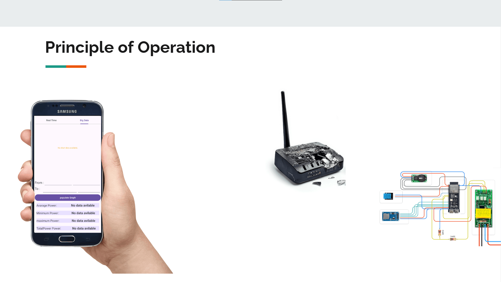
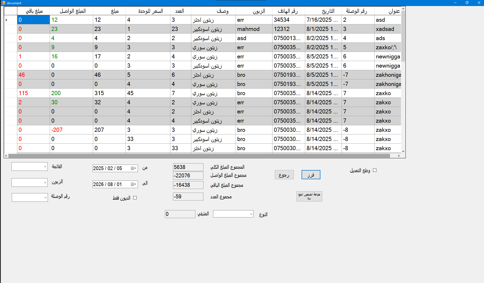
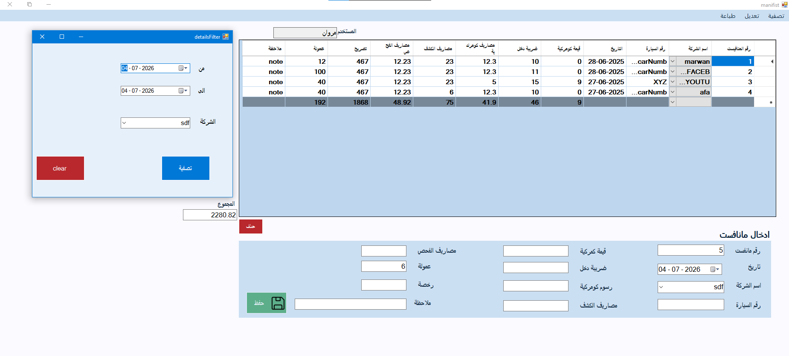

# Marwan Muhammed

### Electrical Engineer | Software Developer 

## 👨‍💻 About Me

- main email :  **marwan50craft@gmail.com**

---

## 🛠️ Tech Stack

### Languages
- JavaScript
- C++
- TypeScript

### framework
- .net framework
- React native
- unity c#
- Embedded C

### Database
- Microsoft SQL
- appwrite

### Tools
- git/github
- chatgpt :]

---

## Projects summary

| Project | Description | Tech |
|---------|-------------|------|
| smart electricity monitoring system| harware and software for the system responsible of monitoring the electricity consumption in a house and sending it to your phone | Embedded C, Java android studio, Sockets|
|youtube TV sim | this project is react native expo application build for providing algorithm-free experiacne for youtube, to avoid wasting too much time on youtube | react-native, expo, typescript, youtubeAPI
| smart irrigation system | a schedual based and remote controled irrigation system with hardware and software | Embedded C, Java android Studio, GSM |
| general poprpos expense tracker (XGMK) | custom built a expense tracker for a local company, with inventory management and expense analysing| C++ CLR .netframework, micorosft SQL |
|my libray 3d | a 3d preview of your PDF files inside your folders, it allowes interactive 3d books | C# unity game engine

---
## More about my Projects

### 1 - smart electricity meter system
this is by far my most advanceda and most organized project
it is a combination of software and hardware that are used to mesure your house electricity consuming and send the data right back to your phone
the application can show the electricity consumption in realtime and also it saves the data throught a period of time showing them alter as graph
they also have a built in machine learning software that learns trends of consumption and based on that predects the price of future consumption

### 2 - Youtube TV Simulator
this is my first react-native application, it is a client for youtube focused on fighting back against addictions and algorithm eating up time, It works by allowing user to only choose some playlists of his choice and the application will make a schdule and decide what to be played when, the user will have no control over the content being player other than choosing what playlists to be played, just like a TV- channel, with little more control, it allowes for full screen playback 

### 3- XGMK
a general porpus expense tracking app I custom built using c++ .netframework 4.8 and microsoft SQL server, it consist of many windows showing sales, expenses, salaries and more.

the app was my first project and it was done during collage, so it was a bit of a mess interms of code, I didn't plan for anything i just wrote code, it didn't contain much oop or software engineering concept

-this image showes the sales tracking windows in the application, with dummy data

### 4 - gumrok
the second of my projects, was also a expense tracker, i decided to make a compleatly new one instead of using parts of my old app, also done during collage but this was much more polished because i learned concepts of oop and some software engineering concepts befor hands, and i applied them in this project, i consider it much better than my first one.
this one too uses the same framework, but i decide to use MSSQLEXPRESS to allow user to use it subscribtion free.

### 5 - My Library 3d 

it is simply an improvement of the UI of windows explorer, and the way it works it turnes folders into shelfs and organizes the PDF files in that folder into books on that shelf.
it was written in C# and unity game engine for rendering

this image showes the result

the app was born from a silly idea I had while reading software engineering book, in a chapter about UI it says something like "the user interface should make sens based on applicaiotn, it doens't make sens for a air traffir control system to be a spread sheet"
so i decided to work the other way around, what if I made a spreadsheet based app into a interractive UI like air traffic control

---

## Contact me
primary Email : marwawn50craft@gmail.com

---
